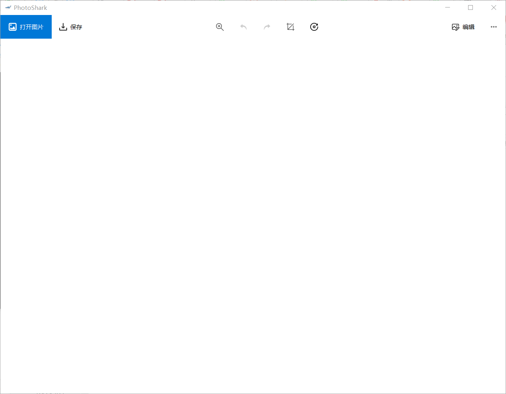

# Simple Image Processor & Viewer

------------------------ 

This is a simple image processor building with `Qt` & `opencv`. For GUI, it references Image Application on Windows 10.

## NOTE
These functions are implemented without improvements, thus performance is bad. For better use, it is recommended that you
should open with `lena.png`, which is in our root folder

## Usage
Make sure resource folder and qss folder are in the same folder with application.

Under that condition, we only need to double-click this application and after a few seconds, the application will
appear on you screen.

## Versions
### V0.0.1
V0.0 is a very basic application. It is not strong enough and supports only few functions. All functions it 
supports list bellow

- [x] open
- [x] save
- [x] undo & redo
- [x] filters
    - [x] Gaussian
    - [x] Median
    - [x] Mean
- [x] Edge detection
    - [x] Robert
    - [x] Sobel
    - [x] Prewitt
   
### V0.0.2
v0.0.2 is developing.
We may need refactoring (This is my first time programming with `Qt` though it is efficient)

- [x] Grayscale mode
- [x] Binary mode
- [x] Grayscale operations
    - [x] Grayscale gradient
        - [x] standard
        - [x] external
        - [x] internal
    - [x] Reconstruction
        - [x] dilation
        - [x] erosion
        - [x] opening
        - [x] closing
- [x] Binary operations
    - [x] Conditional dilation
    - [x] edge detection
        - [x] standard
        - [x] external
        - [x] internal
        
Conditional dilation only supports opening, mask is the current image, marker is opening result with mask. The algorithm is the 
same as that described on PPT.

用中文吧 (  
所有的重建都必须是shape一致的，否则会直接Assert失败退出(未作Assert失败报警)